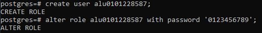
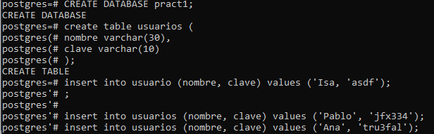

# Introducción a PostgreSQL

**El alumno debe instalar el SGDB postgresql y crear una base de datos de prueba.**

En primer lugar, se debe acceder al servicio mediante `sudo -u postgres psql`. Una vez dentro, debemos crear el usuario con el que trabajaremos. En este caso se llamará **alu0101228587** y tendrá por contraseña **0123456789**

Finalmente, crearemos una base de datos, donde generaremos una tabla de prueba que se llama **usuarios** e insertaremos varios valores:

