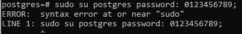

# Introducción a PostgreSQL

**El alumno debe instalar el SGDB postgresql y crear una base de datos de prueba.**

En primer lugar, se debe acceder al servicio mediante `sudo -u postgres psql`. Una vez dentro, debemos establecer una contraseña para el súper usuario de postgreSQL: postgres.

Desafortunadamente, el comando nos da error.

Luego debemos crear el usuario con el que trabajaremos. En este caso se llamará **alu0101228587**.

Finalmente, crearemos una base de datos, donde generaremos una tabla de prueba que se llam **usuarios** e insertaremos varios valores:

