# **Práctica 6 - Modelo Objeto-Relacional: Arquitectos**
## Jaime Simeón Palomar Blumenthal - alu0101228587@ull.edu.es

### **Índice**
1. [Objetivo de la práctica](#objetivo)
2. [Modelo Objeto-Relacional frente al Relacional](#ORvsR)
3. [Modelo](#modelo)
4. [Carga y consulta de datos](#datos)

### **Objetivo de la práctica** <a name="objetivo"/>

Para la realización de la práctica se hará uso del siguiente enunciado:

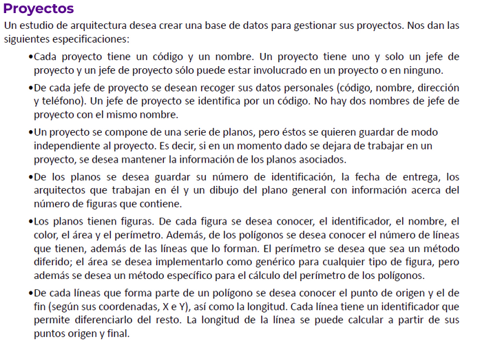

Los datos se deben modelizar utilizando el paradigma Objeto-Relacional, implementarlo en un script de PostgreSQL para generar las tablas y tipos de datos compuestos en PSQL, realizar una carga de datos y una serie de consultas para confirmar que los aspectos modelados coinciden con los de la base de datos.

### **Modelo Objeto-Relacional frente al Relacional** <a name="ORvsR"/>

Es innegable que el modelo Objeto-Relacional es una iteración de su predecesor Relacional. Todo lo que añade el primero sirve para mejorar la experiencia del Gestor de la Base de Datos, o para dar soporte a formas más eficientes de modelizar.

Desde permitir la herencia de tablas hasta la simple idea de tener clases y objetos en lugar de tablas o relaciones como tal, todo trabaja a servicio de acercarse a conceptos adaptados de la programación que no complican en absoluto la entrada de modeladores desde sectores externos.

En relación a la programación también cabe destacar que, gracias a la implementación de clases y objetos, este modelo permite una integración muy simple con lenguajes orientados a objetos, que supone entorno a 7 de los 20 más populares de los últimos años.

Por otro lado, cabe destacar que las bases de datos orientadas a objetos no están tan extendidas como las relacionales puras, lo que limita en gran medida el modelo Objeto-Relacional. Esto es debido a lo relativamente joven que es este concepto y lo extendido que está el Relacional, cuyos orígenes datan de 1970 y las bases postuladas por Edgar Frank Codd.

Finalmente, mencionar que, si bien el modelo Objeto-Relacional es muy flexible, existen diversos casos donde resulta muy ineficiente.

### **Modelo** <a name="modelo"/>

El modelo consta de 6 clases para representar objetos reales del enunciado (Proyectos, Planos, etc), una para representar una relación muchos a muchos entre las Figuras y los Planos que las emplean, y dos tipos de datos compuestos que representan un punto (X, Y) y una dirección (Tipo de vía, nombre, etc).

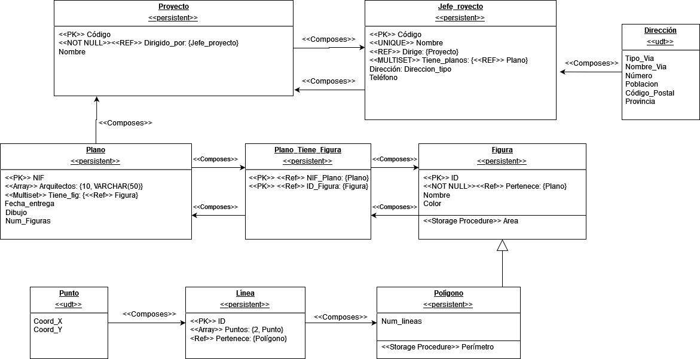

### **Carga y consulta de datos** <a name="datos"/>
En este apartado crearemos un objeto de cada clase y mostraremos todos los de esta.

* **Proyecto**

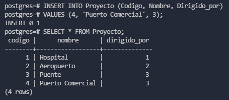

* **Jefe_Proyecto**

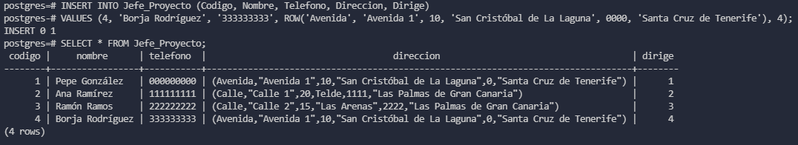

* **Plano**

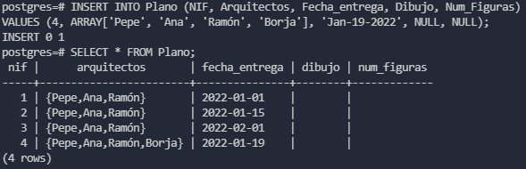

* **Figura**

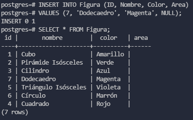

* **Plano_Tiene_Figura**

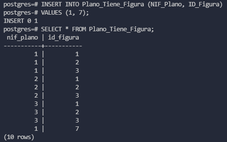

* **Polígono**

* **Línea**

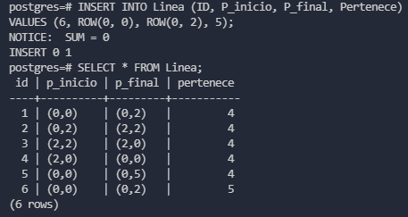

Podemos observar que el disparador que calcula el perímetro de cada polígono cuando se inserta una línea se dispara correctamente, pese a que el cálculo que haga sea incorrecto.

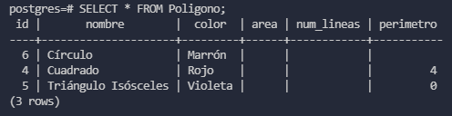

Se entiende que el error está en el cálculo de la función Longitud(Punto_type, Punto_type):

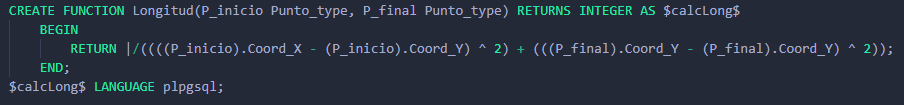

La función llamada por el disparador simplemente comprueba si la línea pertenece a algún Polígono existente y, si es así, con cada línea perteneciente a este calcula la longitud con la función anterior y la suma en un acumulador para, finalmente, actualizar el atributo _Perímetro_ del polígono con _ID_ igual al de las líneas.

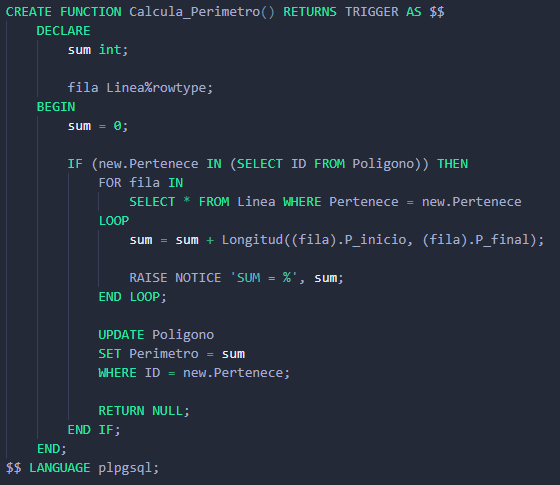

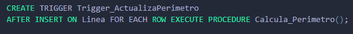